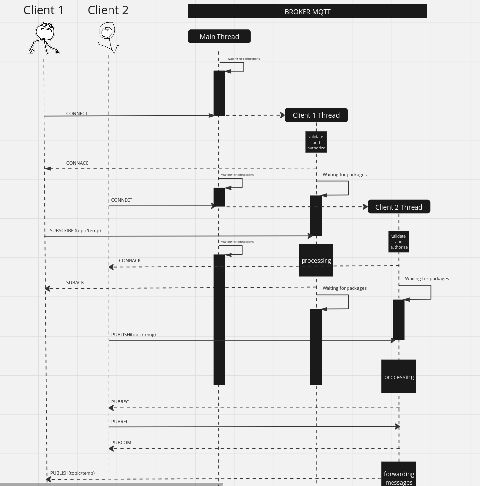

# MQTTv5 BROKER

This is our implementation of an basic MQTT broker

## Features

The implementation includes: All packets format excluding AUTH, Keep Alive, Last Will
and QOS0, 1, 2 mechanism

## Does not include

The project does not include: Message Properties, Clients Auth, Persisten session and session state

## Sequence Diagram

